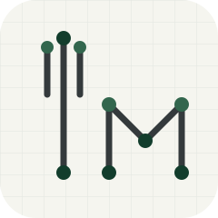

# Tabular Manner

An engine built for designing data processing workflows low-code platform using a graph-based model.

<p>
  
  
  
</p>

## Getting Started

A pipeline is a JSON graph: a list of `nodes` (each with an `id`, `type`, `name`, and `params`) connected by `connections` (`from` -> `to`). Below is `samples/json/basic_clean_pipeline.json`, a simple linear pipeline that fetches data, selects columns, fills missing values, then exports the result:

```json
{
  "name": "Basic Clean Pipeline",
  "nodes": [
    {
      "id": "1",
      "type": "fetch_internal",
      "name": "Fetch Data",
      "params": { "key": "raw" }
    },
    {
      "id": "2",
      "type": "select",
      "name": "Select Columns",
      "params": { "columns": ["customer", "amount", "quantity"] }
    },
    {
      "id": "3",
      "type": "fill_mean",
      "name": "Fill Missing (Mean)",
      "params": { "columns": ["amount", "quantity"] }
    },
    {
      "id": "4",
      "type": "push_internal",
      "name": "Export Result",
      "params": { "key": "cleaned" }
    }
  ],
  "connections": [
    { "from": "1", "to": "2" },
    { "from": "2", "to": "3" },
    { "from": "3", "to": "4" }
  ]
}
```

Run it with the built-in engine:

```python
from tabular_manner.engine.bootstrap import build_engine
import json

engine = build_engine()

with open("samples/json/basic_clean_pipeline.json") as f:
    spec = json.load(f)

for event in engine.execution.execute(spec=spec):
    print(event["event"], event.get("data", ""))
```

More graph patterns (branching, joins, `switch`/`if` control nodes) are available under `samples/json/`.