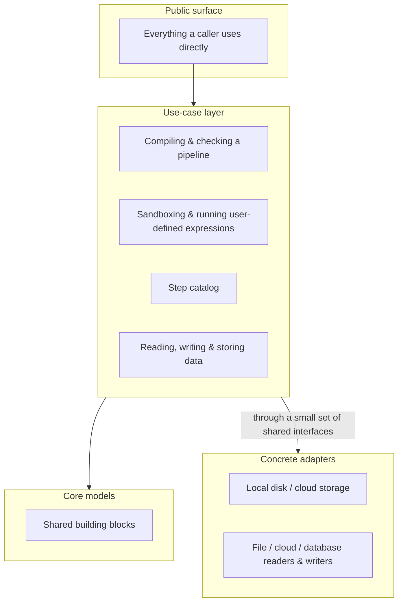

# Tabular Manner

An embeddable engine for designing and running tabular data processing workflows as a graph of composable operators, built on top of [Polars](https://pola.rs/).

<p>
  
  
  
</p>

Tabular Manner turns a JSON description of a pipeline - a set of typed processing steps wired together by connections - into a lazily evaluated execution plan, then runs it while streaming structured progress back to the caller. It powers [Tabular Hub](https://github.com/Minh1billion/tabular-hub)'s visual workflow builder, but has no dependency on it: it can be embedded directly in any Python process, script, or service.

## Table of contents

- [Core ideas](#core-ideas)
- [Architecture](#architecture)
- [Module roles](#module-roles)
- [Usage examples](#usage-examples)
- [Techniques used](#techniques-used)
- [Important notes](#important-notes)
- [Documentation](#documentation)

## Core ideas

A pipeline is plain JSON: a list of steps and a list of connections between them. There is no separate language to learn - the whole graph is data, which is what makes it safe to build, store, and edit from a UI. A full example is shown under [Usage examples](#usage-examples).

A few ideas run through the whole engine:

- **Nothing runs until it has to.** Every step operates on a lazily evaluated table. Building the graph, wiring connections, and most correctness checks are effectively free - actual computation only happens where a result is truly needed: writing output, previewing a page of rows, counting rows.
- **Every operation is a stream of progress updates, not a single return value.** Importing data, exporting it, checking a pipeline for mistakes, and running it all report their progress as a sequence of small status updates ending in a success or failure. This is what lets a caller show live progress and cancel a long-running operation without any bespoke plumbing per operation.
- **The core doesn't know where data lives.** Reading from a file, cloud storage, or a database, and writing to any of the same destinations, are interchangeable behind a small, common interface. The part of the engine that checks and runs a graph never needs to know which one is actually in play.
- **Tenancy is a first-class concept.** A pipeline can optionally be scoped to a named space, so a single running engine can safely serve many isolated workspaces at once - each with its own custom step library and its own stored datasets.
- **User-authored logic is checked, not blindly run.** A custom processing step is defined as a short expression rather than free-form code; before it's accepted, the expression is parsed and checked against a strict allow-list of what it's permitted to do, then evaluated with a small purpose-built interpreter rather than Python's own dynamic evaluation.

## Architecture

The engine is organized as a small hexagon: a public surface, a use-case layer that holds all the actual logic, a small set of core models at the center with no dependency on anything above or below it, and swappable adapters at the very edge.



The dependency direction only ever points inward: the use-case layer depends on the core models, and reaches the concrete adapters only through interfaces it defines for itself - never the other way around. The core models have no dependency on anything above or below them, which is what keeps them easy to test and reuse on their own.

Everything a consumer needs is importable from a single top-level entry point (shown in the examples below). Reaching past it into the layers underneath works today but isn't part of the supported surface and can change without notice; if that becomes a regular need, it's usually a sign something should be exposed as a proper option on that entry point instead.

## Module roles

**The public surface** groups three kinds of operations: managing datasets (bringing data in, listing, previewing, removing, exporting), compiling and running pipelines (checking a pipeline for mistakes, running it, cancelling it partway through), and managing the step catalog (adding, listing, and removing custom steps). These are thin, orchestration-only pieces of code - they validate arguments and delegate to the layer underneath, translating the outcome into the stream of progress updates described above.

**The core models** are a handful of small, framework-free building blocks: the definition every processing step follows (what parameters it needs, what shared resources it depends on, how many inputs/outputs it has, how its type checking behaves); an immutable record of one execution, carrying the underlying lazy table together with the ordered list of steps that produced it; a lightweight description of a table's shape, used to reason about a pipeline without touching real data; and the saved definition of a user-created step.

**Compiling and checking a pipeline** happens in a few passes, run before anything touches real data: turning the JSON description into an internal graph; checking its structure (no duplicate ids, no dangling connections, at least one starting point, no cycles); checking each step's own parameters and how many inputs it's wired to; and finally, walking the graph purely in terms of table shapes to catch a type mismatch (for example, joining on a column an earlier step would have removed) before a single row is processed. This checking pass is deliberately generous about surfacing problems: a broken step doesn't just fail on its own - everything downstream of it is reported as blocked too, while unrelated branches of the same pipeline are still checked fully.

**Sandboxing and running user-defined expressions** is two small, independent pieces working together: a checking pass that inspects an expression's structure and rejects anything outside a short allow-list of safe operations and names, and a separate, minimal interpreter that evaluates an already-checked expression - at no point is Python's own dynamic code evaluation used on anything a user typed. Sitting alongside these is a small registry of shared resources (readers, writers, storage) that gets handed to each step, just before it runs, based on what that step declares needing.

**The step catalog** holds two layers per workspace: steps that ship with the engine, and steps registered at runtime. The built-in steps are grouped by what they do - column- and row-level operations (selecting, filtering-like operations, filling gaps, casting types, string handling, normalization, and more), the operations that combine two inputs into one, and the read/write steps for every supported source and destination. A small service is what turns a user's expression into a real, working step: it checks the chosen name doesn't collide with anything, checks the expression is safe, test-runs it once against a placeholder column to confirm it actually produces a valid column expression, then makes it available for use exactly like a built-in step - and persists it so it survives a restart.

**Reading, writing, and storing data** is kept behind a small set of interchangeable pieces: something that looks up the right way to read or write a given kind of source by name and builds it with the given settings; an internal dataset store used for data passed between pipelines, always kept in a compact columnar format on disk, with a streaming path for very large results; and a small registry of storage backends (local disk and cloud storage out of the box) that builds the right concrete implementation for whichever one is configured.

**The concrete adapters** are the actual implementations behind those interfaces - for local and cloud storage, and for reading and writing files, cloud objects, and database tables. None of the logic above needs to know which one is actually in use; adding a new source or destination means implementing one of these small interfaces, not touching the checking or running logic at all.

## Usage examples

**Run a simple pipeline.** A pipeline that fetches a dataset, selects some columns, fills in missing values, and exports the result:

```python
import json
from tabular_manner.engine import build_engine

engine = build_engine()

with open("samples/json/basic_clean_pipeline.json") as f:
    spec = json.load(f)

for event in engine.execution.execute(spec=spec):
    print(event["event"], event.get("data", ""))
```

The pipeline file itself is plain JSON - steps with an id, a type, and parameters, connected by a simple list of "from this step, to that step":

```json
{
  "nodes": [
    { "id": "1", "type": "fetch_internal", "params": { "key": "raw" } },
    { "id": "2", "type": "select", "params": { "columns": ["customer", "amount"] } },
    { "id": "3", "type": "push_internal", "params": { "key": "cleaned" } }
  ],
  "connections": [
    { "from": "1", "to": "2" },
    { "from": "2", "to": "3" }
  ]
}
```

**Check a pipeline before running it.** Useful for surfacing mistakes without touching any data - this is what a UI would call before letting someone press "run":

```python
for event in engine.execution.validate(spec):
    if event["event"] == "failed":
        for err in event.get("errors", []):
            print(f"{err['node_id']}: {err['message']}")
```

**Combine two inputs into one.** A step that needs two inputs (like a join) says which input is which using a label on the connection, instead of relying on arrival order:

```json
{
  "connections": [
    { "from": "customers", "to": "join_step", "into": "left" },
    { "from": "amounts",   "to": "join_step", "into": "right" }
  ]
}
```

**Add a custom step.** A custom step is just a short expression over a column, kept safe by the sandboxing described above:

```python
for event in engine.node_library.register_transform(
    name="discounted_price",
    expression="value * 0.9",
    description="Apply a flat 10% discount",
):
    print(event["event"])
```

Once registered, it can be used in any pipeline exactly like a built-in step - a step whose `type` is `"discounted_price"`.

More pipeline shapes (branching into multiple outputs, joining two sources, combining several datasets) live under `samples/json/`.

## Techniques used

- **Lazy, deferred execution.** Every step works with a lazily evaluated table rather than a fully loaded one, so building and checking a pipeline never touches real data - the underlying computation is only carried out where a result is actually needed.
- **A uniform, streamable execution protocol.** Every operation exposed to a caller reports its progress as a sequence of small status updates rather than a single return value, so a long-running run, a large import, or a pipeline check can all be shown live and cancelled the same way, regardless of what kind of work is underneath.
- **Strict allow-listing instead of dynamic code evaluation.** A user-supplied expression is parsed and checked against a short, explicit allow-list of what it's permitted to reference and call, then evaluated by a separate, minimal interpreter written specifically for this purpose - Python's own dynamic evaluation is never used on anything a user typed.
- **Graph traversal as a streaming worklist.** Running a pipeline is a breadth-first walk through the graph; a single step can report intermediate progress (useful for very large reads/writes) before producing its final result, and a step that needs two inputs safely buffers whichever one arrives first until both are ready.
- **Two-pass checking.** A pipeline is checked structurally and step-by-step first, then - for whatever part of it remains valid - checked again purely in terms of table shapes, so a type-level mistake several steps downstream is caught before anything actually runs.
- **Cycle detection with a readable trace.** A pipeline that loops back on itself is rejected with the actual cycle spelled out, not just a generic "cycle detected" message.
- **A bounded cache of already-checked pipelines.** Checking a pipeline and running it are decoupled: a checked pipeline is kept ready to run for a while, and the least recently used one is dropped once too many are being kept at once.
- **Registration by decoration.** Both new built-in steps and new storage backends are added by decorating a class, rather than editing a central list - new capability plugs in without modifying the catalog itself.
- **Isolation by workspace.** A single running engine can safely host many isolated workspaces - each with its own step catalog and stored datasets - and idle workspaces can be automatically released after a period of inactivity in long-running processes.
- **Type-checking a step by actually running it, on an empty table.** Rather than hand-maintaining a separate "what does this do to the columns" rule for every step, the default type-checking behavior simply runs the step's own logic against an empty, correctly-typed table and reads back the result - keeping that logic in exactly one place.

## Important notes

- **Only the top-level entry point is a supported surface.** Everything reached through it is an implementation detail that can change between versions without a deprecation cycle.
- **The expression sandbox is not a general-purpose way to run Python.** It allow-lists a small, fixed set of safe operations - enough for simple column expressions like arithmetic, comparisons, and a short list of common table operations. Widening what it allows should be treated as a security-relevant change, not a convenience tweak.
- **A pipeline must have a starting point and no cycles.** This is enforced before a pipeline built from untrusted input is ever turned into something runnable; a second, lighter-weight safeguard exists at run time as well, specifically for pipelines assembled through some other path.
- **Checking and running are separate steps, and a checked pipeline doesn't stay ready forever.** Treat the reference returned after checking a pipeline as short-lived, not as something to hold onto across long delays or a restart.
- **Running the same pipeline more than once at the same time needs distinct identifiers.** Otherwise, a step that combines two inputs from one run could end up waiting on input from a different, unrelated run.
- **Live progress is opt-in per step.** Only steps that specifically support it report fine-grained progress; everything else only reports that it started and that it finished.
- **A custom step can never reuse a built-in name.** Trying to register or remove a custom step under a name that's already built in fails immediately, rather than silently overriding anything.

## Documentation

Full API and node reference: [minh1billion.github.io/tabular-manner](https://minh1billion.github.io/tabular-manner/)
